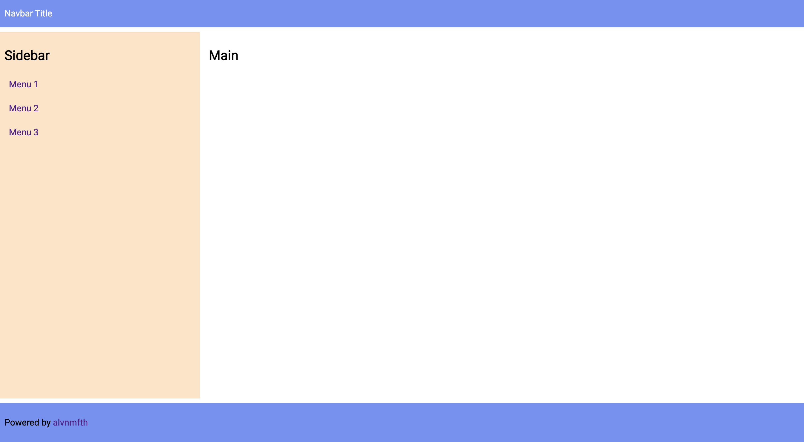

# Styling with Grid CSS

## Goals

## Brief
- Must be understand at least, `display: grid`, `grid-template-areas & grid-area`, `grid-template`
- Add `display: grid` in "grid-container".
- Add `grid-template-areas` property in "grid-container", and specifies grid areas names and associate grid-placement.
- Add `grid-template-rows` property in "grid-container" to specifies "track-lists".
- Name every "grid-items" with specified `grid-template-areas` name.
- Adujust every "grid-items" to layout.